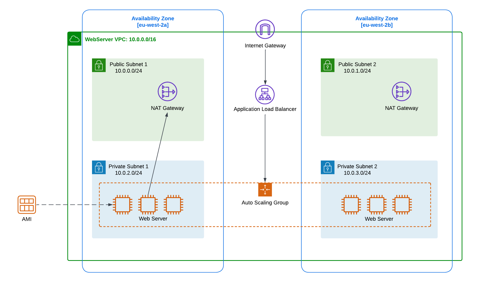
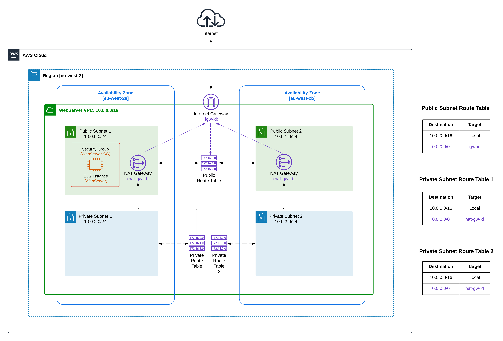

 

  <h1 align="center">Traditional-Web-Hosting-On-AWS</h1>
  

     
    Building and Scaling a Traditional Web Hosting Architecture on AWS with EC2, VPC, Load Balancing, Auto Scaling, and Networking.
  

### Project date
------------------
- Deployed via Management Console - TBC
- Deployed via Terraform - TBC

### Tech Stack
------------------
- Amazon EC2
- Amazon VPC
- Application Load Balancer
- Amazon Route 53
- Auto Scaling

### Project Description
-----------------
Many companies utilize a number of traditional technologies within AWS to deliver applications, most of which are less managed than the serverless technologies. These include Elastic Cloud Compute (EC2), which provides virtual machines in AWS, and Virtual Private Cloud (VPC), which provides virtual networking constructs in AWS.

This project explores the traditional technologies, especially focused on the networking stacks within AWS.

### More Information
------------------

Part 1: Deploy a Highly Available Virtual Private Cloud (VPC)
- [Blog](https://awstip.com/traditional-web-hosting-on-aws-3d2f1fc4524a)
- [Lab](https://www.youtube.com/watch?v=wdHhvifXs14&t=1200s)

Part 2: Load Balancing and Automatic Scaling To further enhance the availability and scalability of my application.
- Blog (coming soon)
- Lab (coming soon)

### Objectives
-----------------

Part 1: Deploy a Highly Available Virtual Private Cloud (VPC)

- [X] Create Public and Private Subnets in two Availability Zones.
- [X] Create an Internet Gateway and attach to VPC.
- [X] Create a Network Address Translation (NAT) gateway in both of the public subnets for high availability.
- [X] Configure the network to send internet-bound traffic from instances in Private Subnets to the NAT gateway.
- [X] Configure Route Tables and add a route to direct internet-bound traffic (0.0.0.0/0) to the internet gateway.
- [X] Edit subnet associations. 
- [X] Create a Security Group for the Web Server and configure it to permit HTTP (port 80) traffic that comes from anywhere on the internet (0.0.0.0/0).
- [X] Launch a Web Server EC2 Instance in the Public Subnet to test VPC is configured correctly.
- [X] Confirm that the Web Server EC2 instance can be accessed from the internet.

Part 2: Load Balancing and Automatic Scaling To further enhance the availability and scalability of your application
- [ ] Create an EC2 instance based on an Amazon Linux 2 AMI from AWS. Make the instance publicly accessible to the internet. Ensure EC2 instance only allows HTTP (and, optionally, HTTPS) traffic from the public internet.
- [ ] Install a web server using the user_data property on the EC2 instance, invoke yum to download httpd (Apache). 
- [ ] Configure high availability by using duplicate EC2 instances in multiple Availability Zones in the same Region. Route traffic from the internet across each of the EC2 instances by using an Application Load Balancer.
- [ ] Setup Auto Scaling with EC2 Auto Scaling with at least two instances. Use CPU Utilization as the scaling metric. Attach Application Load Balancer to the Auto Scaling Group.
- [ ] Secure networking by moving EC2 instances to a private subnet in VPC. A private subnet is defined as one that does not have a NAT Gateway in it, so it cannot reach the public internet. Lock down EC2 instance’s Security Groups to only allow traffic from the Application Load Balancer.
- [ ] Allow web server to communicate with the internet. Update network stack to create public subnets with NAT Gateways and route table rules to allow traffic from private subnets to the public subnets.
- [ ] Point DNS Application Load Balancer.
