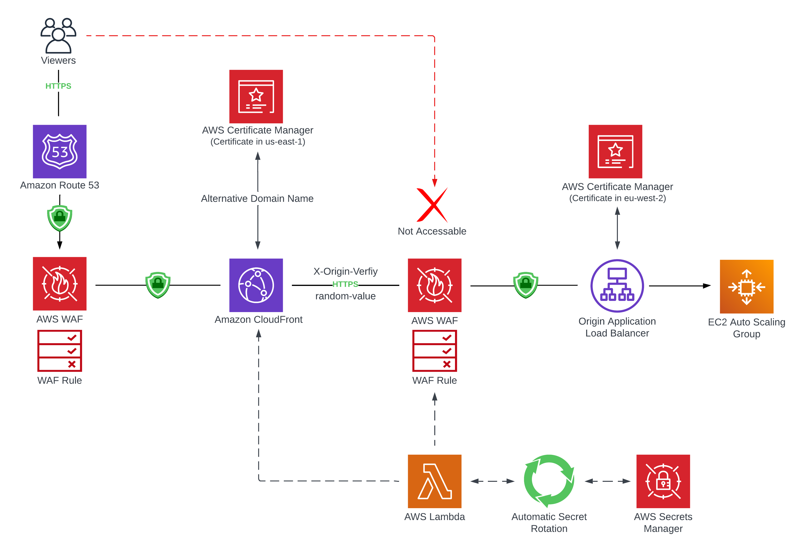

 

  <h1 align="center">Traditional-Web-Hosting-On-AWS</h1>
  

     
    Building and Scaling a Traditional Web Hosting Architecture on AWS with EC2, VPC, Load Balancing, Auto Scaling, and Networking.
  

### Project date
------------------
- Deployed via Management Console - 18 July 2023
- Deployed via Terraform - TBC

### Tech Stack
------------------

### Overview of the Series
-----------------

In today’s digital landscape, many companies rely on a combination of traditional and Serverless technologies within Amazon Web Services (AWS) to deliver robust and scalable applications. While Serverless technologies offer enhanced manageability, traditional technologies such as Elastic Cloud Compute (EC2) and Virtual Private Cloud (VPC) still play a vital role.

In this multi-part series, I cover important aspects of hosting a traditional web application on AWS. From laying the foundation with a resilient Virtual Private Cloud to creating a highly available and dynamically scalable environment with the Application Load Balancer, Launch Templates, and Auto Scaling groups.

Moving forward I enhanced the security and optimised the performance of my application infrastructure. Advanced strategies for monitoring and logging are at my disposal, ensuring the health and functionality of my environment

Lastly, I will Terraform the whole environment, learning how to provision and manage my entire web hosting environment using code, enhancing reproducibility and scalability.

### More Information
------------------

Part 1: Deploy a Highly Available Virtual Private Cloud (VPC)
- [Blog](https://awstip.com/traditional-web-hosting-on-aws-3d2f1fc4524a)
- [Lab](https://www.youtube.com/watch?v=wdHhvifXs14&t=1200s)

Part 2: Creating a Scalable & Highly Available Environment for a Web Server
- [Blog](https://blog.digitalden.cloud/traditional-web-hosting-on-aws-part-2-creating-a-scalable-and-highly-available-environment-for-4be7f9b7a0ba)
- [Lab](https://youtu.be/c3BUa_5wSjE)

Part 3: Building Robust Security with Amazon CloudFront, AWS WAF & AWS Secrets Manager
- [Blog](https://blog.digitalden.cloud/traditional-web-hosting-on-aws-part-3-building-robust-security-with-amazon-cloudfront-aws-waf-74b2f60bcc94)
- [Lab](https://youtu.be/ujBARGA3224)

Part 4: Monitoring, Security, Compliance with Amazon CloudWatch, VPC Endpoints & AWS Config
- [Blog](https://awstip.com/traditional-web-hosting-on-aws-part-4-monitoring-security-compliance-with-cloudwatch-54121210dcd84)
- [Lab](https://www.youtube.com/watch?v=uEqJL4En_wc)

Part 5: Terraform whole Environment (Coming Soon)

### Objectives
-----------------

### Part 1: Deploy a Highly Available Virtual Private Cloud (VPC)
The first part of this series is all about establishing a resilient Virtual Private Cloud (VPC), which serves as the core of my infrastructure. Ensuring the high availability of critical business systems is paramount in the AWS environment. Manually created a new Virtual Private Cloud (VPC), defined its IP range, and established public and private subnets across multiple Availability Zones for security and availability.

Configured an Internet Gateway for secure external access, explored NAT Gateways for private instance security, set up Route Tables for seamless VPC communication, created Security Groups to control traffic.

Finally, deployed a web server in the public subnet, ensuring its accessibility marking a successful VPC setup.

- [X] Create Public and Private Subnets in two Availability Zones.
- [X] Create an Internet Gateway and attach to VPC.
- [X] Create a Network Address Translation (NAT) gateway in both of the public subnets for high availability.
- [X] Configure the network to send internet-bound traffic from instances in Private Subnets to the NAT gateway.
- [X] Configure Route Tables and add a route to direct internet-bound traffic (0.0.0.0/0) to the internet gateway.
- [X] Edit subnet associations. 
- [X] Create a Security Group for the Web Server and configure it to permit HTTP (port 80) traffic that comes from anywhere on the internet (0.0.0.0/0).
- [X] Launch a Web Server EC2 Instance in the Public Subnet to test VPC is configured correctly.
- [X] Confirm that the Web Server EC2 instance can be accessed from the internet.

### Part 2: Creating a Scalable & Highly Available Environment for a Web Server
In the second instalment I focused on scalability and high availability. I configured an Application Load Balancer to distribute incoming traffic across instances, enhancing system resilience. A launch template streamlined the instance deployment process through an Auto Scaling group, providing control and flexibility. By implementing a secure two-tier architecture and appropriate security group configurations, I ensured robust security. The high availability of my Web Server was thoroughly tested and demonstrated, including its performance under stress conditions.

- [X] Create an Application Load Balancer in WebServer VPC in Public Subnets 1 and Public Subnet 2. Configure a security group for load balancer allowing HTTP & HTTPS traffic. Create a target group with health check settings and configure the HTTP listener on port 80 to forward incoming traffic to the target group.

- [X] Create a launch template that includes instance details, such as the Amazon Machine Image, instance type, security group, and a user data script to install and configure an Apache web server automatically during instance launch.

- [X] Setup Auto Scaling that uses the launch template and deploys EC2 instances in Private Subnet 1 and Private Subnet 2. Attach Application Load Balancer to the Auto Scaling group. Configure group size with a desired capacity of 2, minimum of 2 instances, and a maximum of 6 instances. Configure a target tracking scaling policy with CPU Utilization as the scaling metric. Set CPU utilization at 25%. Enable CloudWatch group metrics collection for quicker response to changing usage patterns. Add tags to identify instances associated with the application.

- [X] Update Web Server Security Group. Lock down EC2 instance’s Security Groups to only allow traffic from the Application Load Balancer. Add a new rule to accept incoming HTTP traffic from the load balancer, while HTTPS traffic is offloaded to the load balancer to reduce the workload on individual application servers.

- [X] Test the Web Server by connecting to the load balancer. Confirm Web Server is running and highly available by checking the Target Groups page to ensure both instances are registered and healthy. Access the load balancer's DNS name in web browser to verifying successful content delivery from one of the EC2 instances in the private subnets.

- [X] Test high availability by terminating one of the Web Server instances to simulate a failure. To test high availability, terminate one of the EC2 instances. The load balancer's health checks should detect the failure and automatically route all requests to the remaining instance. Despite an instance failing, Web Server should remain available. EC2 Auto Scaling then launches a replacement instance, and the load balancer resumes sending traffic between the two Availability Zones, demonstrating high availability.

- [x] Connect to an EC2 Instance in a Private Subnet using EC2 Instance Connect Endpoint. Open port 22 in instance's security group. Create the endpoint in the VPC console, and connect to instance in the private subnet using the EC2 console with the endpoint.

- [X] Test automatic scaling under load. Perform a 10 minute stress test on Web Server instance. During the test, observe the EC2 console to see the Auto Scaling group deploy new instances, up to a maximum of 6. After the stress test, the ASG scales down as needed, maintaining the desired capacity of 2 instances.

### Part 3: Building Robust Security with Amazon CloudFront, AWS WAF & AWS Secrets Manager
In this instalment I enhanced the security and optimised the performance of my application infrastructure. I began by securing HTTPS with ACM Certificates for both ALB and CloudFront. I set up CloudFront with ALB Origin, HTTPS, CNAME, Custom SSL, and Headers.

Seamlessly integrated my domain with CloudFront using the CLI. Enhanced security with a WAF ACL and X-Origin Verification Rule for ALB. Automated Secret Rotation for X-Origin-Verify Header Value using AWS Secrets Manager. Finally, configured a Lambda Function for Secret Rotation and resource management in my AWS environment.

- [X] Secured HTTPS Setup with ACM Certificates for your Application Load Balancer and CloudFront.
- [X] Setting Up CloudFront Distribution with Application Load Balancer Origin, HTTPS, CNAME, Custom SSL Certificate, and Custom Headers.
- [X] Domain Integration with CloudFront Distribution using the CLI.
- [X] Reviewed AWS Web Application Firewall Integration with CloudFront
- [X] Configured a WAF ACL, Associated with you Application Load Balancer and Create an X-Origin Verification Rule.
- [X] Automated Secret Rotation for X-Origin-Verify Header Value using AWS Secrets Manager.
- [X] Configured a Lambda Function for Secret Rotation and Resource Management.
- [X] Reviewed Security Configurations.

### Part 3: Building Robust Security with Amazon CloudFront, AWS WAF & AWS Secrets Manager
In this instalment, I enhanced the security of my AWS infrastructure by configuring VPC Endpoints for AWS Systems Manager and CloudWatch Logs. These endpoints enabled private communication within my VPC, reducing exposure to the public internet. I Enhanced my monitoring capabilities by installing and configuring the CloudWatch Agent on Amazon EC2 instances using the AWS Systems Manager Run Command. 

Additionally, I monitored logs and metrics, set up real-time notifications, enhanced security with AWS CloudTrail, and managed infrastructure compliance using AWS Config for robust AWS infrastructure management

- [X] Create VPC Endpoints to use AWS Systems Manager (SSM) & CloudWatch Logs.
- [X] Use AWS Systems Manager Run Command to install the CloudWatch Agent on Amazon EC2 instances.
- [X] Monitor Application Logs using CloudWatch Agent and CloudWatch Logs.
- [X] Monitor system metrics using CloudWatch Agent and CloudWatch Metrics.
- [X] Create and Review Real-Time Notifications with CloudWatch Events.
- [X] Set up AWS CloudTrail for detailed logging of AWS API activity.
- [X] Ensure Infrastructure Compliance using AWS Config.